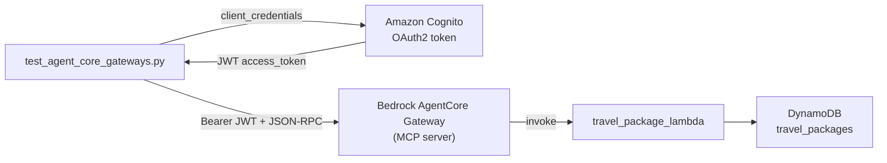

# AgentCore Gateway — Travel Packages (Project 2)

This is the **second project** in the repo. It exercises **Amazon Bedrock AgentCore Gateway**: an MCP-compatible HTTP endpoint that exposes tools backed by AWS resources. Here, a **Lambda** function reads travel package rows from **DynamoDB**.

Project 1 ([`vacation_planner/`](../vacation_planner/README.md)) deploys a **CrewAI agent runtime** on AgentCore. Project 2 deploys a **gateway** that agents (or test clients) call as an **MCP server** to invoke tools—without running the full vacation crew.

## Architecture



| Layer | Component | Role |
|-------|-----------|------|
| **Client** | [`test_agent_core_gateways.py`](test_agent_core_gateways.py) | Gets a JWT, sends MCP JSON-RPC to the gateway |
| **Inbound auth** | Cognito (OAuth2 client credentials) | Gateway requires `Authorization: Bearer <JWT>` on each MCP request |
| **Gateway** | `gateway-vacation-planner-...` | Acts as an **MCP server** (`/mcp`): `tools/list`, `tools/call` |
| **Target** | Lambda + tool schema | Gateway maps tool name → Lambda invoke |
| **Data** | DynamoDB `travel_packages` | City-keyed travel plan, cost, duration |

Inbound authorization uses a **JWT** (from Cognito), not your AWS CLI profile. The gateway execution role (IAM) invokes Lambda separately from that JWT.

## Repository layout

| Path | Purpose |
|------|---------|
| [`test_agent_core_gateways.py`](test_agent_core_gateways.py) | Sample client: token → `tools/list` → `tools/call` |
| [`.env`](.env) | `COGNITO_CLIENT_ID`, `COGNITO_CLIENT_SECRET` (do not commit) |
| [`../lambda_function/travel_package_lambda/lambda_function.py`](../lambda_function/travel_package_lambda/lambda_function.py) | `GetItem` on `travel_packages` by `city` |
| [`../lambda_function/travel_package_lambda/openAPI_schema.json`](../lambda_function/travel_package_lambda/openAPI_schema.json) | MCP **tool schema** for the Lambda target (valid JSON, no trailing commas) |

Tool names exposed by the gateway often look like `target-<target-name>___get_travel_packages`. Use the exact name from `tools/list`.

## Prerequisites

- AgentCore **Gateway** created in the console (e.g. `gateway-vacation-planner-...`)
- **Target** on that gateway: Lambda + tool schema (see gateway troubleshooting if target creation fails)
- **Cognito** app client (client id + secret) linked to gateway OAuth
- Lambda deployed with permission for the gateway role to invoke it
- DynamoDB table **`travel_packages`** with items keyed by `city` (string)

## Cognito credentials (not from AWS profile)

`CLIENT_ID` and `CLIENT_SECRET` come from the **Cognito app client** used for gateway OAuth—not from `aws login` or `~/.aws/credentials`.

1. **Amazon Cognito** → **User pools** → pool used by your gateway
2. **App integration** → **App clients** → copy **Client ID**
3. **Client secret** — only available when the client was created; if lost, create a new secret or app client

Put them in `test_agent_core_gateways/.env`:

```env
COGNITO_CLIENT_ID=your-app-client-id
COGNITO_CLIENT_SECRET=your-app-client-secret
```

Update `TOKEN_URL` in the script if your Cognito domain differs (format: `https://<domain>.auth.<region>.amazoncognito.com/oauth2/token`).

## Install and run

From this directory:

```bash
pip install requests python-dotenv   # or use your project venv
python test_agent_core_gateways.py
```

Update **`gateway_url`** in the script to your gateway MCP endpoint, for example:

```text
https://<gateway-id>.gateway.bedrock-agentcore.us-west-2.amazonaws.com/mcp
```

### What the script does

1. **`fetch_access_token`** — `POST` to Cognito with `grant_type=client_credentials`; returns a **JWT** access token.
2. **`list_tools`** — JSON-RPC `tools/list` with `Authorization: Bearer <JWT>`.
3. **`call_tool`** — JSON-RPC `tools/call` with MCP-shaped params:

```json
{
  "jsonrpc": "2.0",
  "id": "call-tool-request",
  "method": "tools/call",
  "params": {
    "name": "target-travel-agent-tool___get_travel_packages",
    "arguments": { "city": "Savannah" }
  }
}
```

Use **`name`** and **`arguments`**, not `tool_name` / `tool_input`—otherwise the gateway returns `Malformed JSON-RPC request` (`-32600`).

## MCP request reference

| Method | Purpose | Key fields |
|--------|---------|------------|
| `tools/list` | Discover tools | `"params": {}` |
| `tools/call` | Invoke a tool | `params.name`, `params.arguments` |

All requests:

- `POST` to `<gateway_url>/mcp` (or the URL shown in the console)
- Header: `Content-Type: application/json`
- Header: `Authorization: Bearer <access_token>`

## Gateway setup checklist

1. **Create gateway** — note MCP URL and authorizer (Cognito).
2. **Create Lambda target** — ARN of `travel_package_lambda`, inline tool schema from [`openAPI_schema.json`](../lambda_function/travel_package_lambda/openAPI_schema.json).
3. **Lambda** — handler expects `event["city"]`; test in Lambda console with `{"city": "Savannah"}`.
4. **DynamoDB** — table `travel_packages`, partition key `city`.
5. **Permissions** — gateway execution role can `lambda:InvokeFunction`; Lambda resource policy allows `bedrock-agentcore.amazonaws.com` if required.
6. **Run** [`test_agent_core_gateways.py`](test_agent_core_gateways.py) after filling `.env` and `gateway_url`.

### Common target creation errors

| Symptom | Likely cause |
|---------|----------------|
| Gateway created, target failed | Invalid tool schema JSON, wrong Lambda ARN, or Lambda dry-run failed |
| `Malformed JSON-RPC` on call | Wrong `tools/call` params (`tool_name` vs `name`) |
| 401 on MCP requests | Expired token or wrong Cognito client |
| 404 / empty tool result | No DynamoDB item for that `city` |

## Compare with Project 1 (vacation planner runtime)

| | Project 1 — Runtime | Project 2 — Gateway |
|--|---------------------|---------------------|
| **Entry** | AgentCore **runtime** (container / crew) | AgentCore **gateway** (MCP) |
| **Auth** | Runtime / Lambda invoke IAM | **JWT** on gateway (`Bearer`) |
| **Work** | Multi-agent crew + Bedrock + Serper | Single tool → Lambda → DynamoDB |
| **Client** | Streamlit → API GW → Lambda → runtime | [`test_agent_core_gateways.py`](test_agent_core_gateways.py) → gateway |
| **Docs** | [`vacation_planner/README.md`](../vacation_planner/README.md) | This file |

An agent runtime can later **use** gateway tools via MCP; this script proves the gateway and Lambda path in isolation.

## Support

- [AgentCore Gateway documentation](https://docs.aws.amazon.com/bedrock-agentcore/latest/devguide/gateway.html)
- [Model Context Protocol — tools](https://modelcontextprotocol.io/specification/2025-06-18/server/tools)
