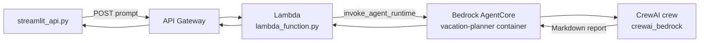

# VacationPlanner Crew (Project 1)

A multi-agent vacation planning app built with [crewAI](https://crewai.com). Two agents—a **Vacation Researcher** and an **Itinerary Planner**—collaborate to research a destination and produce a Markdown travel report. The project uses **Amazon Bedrock** (Nova Pro) for LLM inference, **Serper** for web search, and includes an optional **Amazon Bedrock AgentCore** entry point for deployment.

**Related — Project 2:** [AgentCore Gateway + MCP test client](../test_agent_core_gateways/README.md) — gateway with JWT (Cognito) inbound auth, MCP `tools/list` and `tools/call`, Lambda → DynamoDB travel packages. See also the [repo overview](../README.md).

## Prerequisites

- **Python 3.10–3.13** (`>=3.10,<3.14`) — Python 3.14 is not supported by `crewai==1.14.5`
- [uv](https://docs.astral.sh/uv/) (recommended) or pip
- AWS credentials with access to Amazon Bedrock (Nova Pro model enabled in your region)
- A [Serper](https://serper.dev/) API key for destination research

## Installation

From the `vacation_planner` directory:

```bash
pip install uv        # if needed
uv sync               # creates .venv and installs dependencies
```

Alternatively, using the CrewAI CLI:

```bash
crewai install
```

### Environment variables

Create a `.env` file in the `vacation_planner` directory:

```env
MODEL=bedrock/us.amazon.nova-pro-v1:0
AWS_DEFAULT_REGION=us-west-2
AWS_PROFILE=your-aws-profile
SERPER_API_KEY=your-serper-api-key
```

Verify your AWS profile:

```bash
export AWS_PROFILE=your-aws-profile   # or set in .env
aws sts get-caller-identity
```

## Customizing

- `src/vacation_planner/config/agents.yaml` — agent roles, goals, and backstories
- `src/vacation_planner/config/tasks.yaml` — task descriptions and outputs
- `src/vacation_planner/crew.py` — agents, tools, Bedrock LLM, and AgentCore entry point
- `src/vacation_planner/main.py` — default `topic` and other kickoff inputs

The destination is passed as the `topic` input and interpolated into YAML templates as `{topic}`.

## Running the Project

All commands below should be run from the `vacation_planner` directory.

### CLI (crew)

```bash
crewai run
```

Equivalent uv commands:

```bash
uv run vacation_planner
# or
uv run run_crew
```

By default, `main.py` sets `topic` (e.g. `Savannah, GA`) and writes a Markdown report (`report.md`) in the project folder.

### Vacation Planner UI (Streamlit)

A browser-based UI is available in [`streamlitui.py`](streamlitui.py). Enter a destination, run the crew, and view or download the generated plan.

```bash
uv run streamlit run streamlitui.py
```

Streamlit opens a local URL (typically `http://localhost:8501`).

### Vacation Planner UI (Streamlit + API Gateway + Lambda + AgentCore + AWS Bedrock)

[`streamlit_api.py`](streamlit_api.py) is the **production-style UI**. It does not run the crew locally — it calls your deployed AWS stack:

```
streamlit_api.py  →  API Gateway  →  Lambda  →  AgentCore Runtime  →  Vacation Planner crew → AWS Bedrock (model)
```

| Layer | Component | Role |
|-------|-----------|------|
| UI | [`streamlit_api.py`](streamlit_api.py) | Sends `POST {"prompt": "<destination>"}` to API Gateway |
| API | API Gateway (`vacation_planner_resource`) | HTTP endpoint in front of Lambda |
| Compute | [`lambda_function/lambda_function.py`](../lambda_function/lambda_function.py) | Maps `prompt` → `topic`, calls `invoke_agent_runtime` |
| Agent | AgentCore Runtime (ECR container) | Runs `crewai_bedrock` in [`crew.py`](src/vacation_planner/crew.py) |

**Request flow**

1. User enters a destination in Streamlit.
2. `streamlit_api.py` posts to API Gateway.
3. Lambda receives the event, builds payload `{"topic": "<destination>"}`, and invokes the AgentCore runtime.
4. AgentCore runs the Vacation Planner crew (Bedrock Nova Pro + Serper search).
5. Lambda returns `{"result": "<markdown report>", "session_id": "..."}`.
6. Streamlit parses `body["result"]` and displays the Markdown plan.

Run the API-backed UI:

```bash
uv run streamlit run streamlit_api.py
```

Update `API_URL` in `streamlit_api.py` to your API Gateway invoke URL if it differs.

**Compare the two UIs**

| File | Runs crew | Use case |
|------|-----------|----------|
| [`streamlitui.py`](streamlitui.py) | Locally (in-process) | Development / demo without AWS deploy |
| [`streamlit_api.py`](streamlit_api.py) | Via API Gateway → Lambda → AgentCore | End-to-end AWS architecture |

## Docker: Build, Run & Test (local Docker Desktop)

Use this section to build and run the **same container image as production** on your machine with **Docker Desktop** — before pushing to AWS. This is **not** the AgentCore deploy path.

| Goal | Script | Where it runs |
|------|--------|----------------|
| Build image on your laptop | [`docker_build.sh`](docker_build.sh) | Local Docker Desktop (`--load`) |
| **Run container locally** | [`docker_run.sh`](docker_run.sh) | Local Docker Desktop (`localhost:8080`) |
| Test `/ping` and `/invocations` | [`test_agent.sh`](test_agent.sh) | Against the local container |
| Push image to AWS for AgentCore | [`build_push_ecr.sh`](build_push_ecr.sh) | ECR only (does not load into Docker Desktop) |
| Register image with AgentCore | [`deploy_agentcore.sh`](deploy_agentcore.sh) | AWS API + AgentCore (not local Docker) |

Package and test the AgentCore entry point using [`Dockerfile`](Dockerfile) and the scripts above.

This project pins `bedrock-agentcore>=1.7.0,<1.8.0` to stay compatible with `crewai[bedrock]==1.14.5`. Images are built for **`linux/arm64`** (required for AgentCore deployment).

Make the scripts executable (once):

```bash
chmod +x docker_build.sh docker_run.sh test_agent.sh build_push_ecr.sh deploy_agentcore.sh wait_agent_runtime_ready.sh aws_ecr_create.sh update_serpapi_key.sh
```

### 1. Export AWS credentials

The container needs AWS credentials to call Bedrock. From the `vacation_planner` directory, set your profile and export credentials into the current shell:

```bash
export AWS_PROFILE=rwuniard                    # use your profile name
aws login --profile rwuniard                   # refresh credentials if needed

eval $(aws configure export-credentials --profile rwuniard --format env)
```

The `export-credentials` command prints `export AWS_ACCESS_KEY_ID=...` lines — wrapping it with `eval $(...)` loads them into your current shell so `docker_run.sh` can forward them to the container.

This sets `AWS_ACCESS_KEY_ID` and `AWS_SECRET_ACCESS_KEY` in your terminal. Verify:

```bash
aws sts get-caller-identity
echo $AWS_ACCESS_KEY_ID
```

**Notes:**

- Session tokens expire — re-run `aws login` and the `eval` command if Bedrock calls fail later.
- `docker_run.sh` forwards `AWS_ACCESS_KEY_ID`, `AWS_SECRET_ACCESS_KEY`, and `SERPER_API_KEY` into the container (loads `.env` if present).

### 2. Build the image

From the `vacation_planner` directory:

```bash
./docker_build.sh
```

This runs `docker buildx build --platform linux/arm64` and tags the image as `vacation-planner:latest` and `vacation-planner:<git-commit>`.

### 3. Run the container locally (`docker_run.sh`)

[`docker_run.sh`](docker_run.sh) starts the agent in **Docker Desktop on your machine** — not on AgentCore. Use it to mimic production (`/ping`, `/invocations`) before you push to ECR.

In **terminal 1** (keep it open — the server runs in the foreground):

```bash
./docker_run.sh
```

This runs `docker run` against `vacation-planner:latest` and:

- Binds **port 8080** on `localhost` (same ports AgentCore expects)
- Loads **`vacation_planner/.env`** if present (`SERPER_API_KEY`, etc.)
- Passes **AWS credentials** and **`SERPER_API_KEY`** from your shell into the container
- Names the container `vacation-planner-local` (remove with `docker rm -f vacation-planner-local` if needed)

Runs `python -m vacation_planner.crew` with **`OTEL_SDK_DISABLED=true`** so ADOT does not try to export traces to `localhost:4317` (there is no OTLP collector in local Docker). The **production** image CMD still uses `opentelemetry-instrument`; on AgentCore, AWS injects OTEL export settings for CloudWatch.

Ensure `SERPER_API_KEY` is in `.env` or exported before running `./docker_run.sh`. On AgentCore you set that on the runtime; locally you pass it via this script.

**If you still see `Failed to export traces to localhost:4317`:** rebuild the image after pulling script changes, or confirm `docker_run.sh` overrides the image CMD (do not run `docker run vacation-planner:latest` without that script).

If port 8080 is already in use:

```bash
lsof -i :8080
docker rm -f vacation-planner-local
```

### 4. Test the agent

In **terminal 2**, while the container is running:

```bash
./test_agent.sh
```

Or run the steps manually:

```bash
curl http://127.0.0.1:8080/ping

curl -X POST http://127.0.0.1:8080/invocations \
  -H "Content-Type: application/json" \
  -d '{"topic": "Savannah, GA", "current_year": "2026"}'
```

A successful `/invocations` response returns the crew's Markdown report. The run may take several minutes (Bedrock LLM calls + Serper web search).

### Helper scripts (local Docker Desktop vs AWS deploy)

| Script | Local Docker Desktop? | Purpose |
|--------|----------------------|---------|
| [`docker_build.sh`](docker_build.sh) | **Yes** — loads image into Docker Desktop | Build ARM64 image (`vacation-planner:latest` + git tag) |
| [`docker_run.sh`](docker_run.sh) | **Yes** — runs on `localhost:8080` | Start the agent container locally; forwards AWS creds + `SERPER_API_KEY` from `.env` |
| [`test_agent.sh`](test_agent.sh) | **Yes** — calls local `127.0.0.1:8080` | POST test payload to `/invocations` |
| [`build_push_ecr.sh`](build_push_ecr.sh) | **No** — pushes straight to ECR | Production image upload (see [Deploy to AgentCore](#deploy-to-agentcore)) |
| [`deploy_agentcore.sh`](deploy_agentcore.sh) | **No** — updates AgentCore in AWS | Register ECR image, wait for READY, pin `vacation_planner` endpoint |
| [`wait_agent_runtime_ready.sh`](wait_agent_runtime_ready.sh) | **No** | Called by deploy / Serper scripts; polls until a runtime version is `READY` |
| [`update_serpapi_key.sh`](update_serpapi_key.sh) | **No** | Set or rotate `SERPER_API_KEY` on the runtime (not part of every image deploy) |

When the agent runs on **AgentCore**, the runtime uses its **IAM execution role** for Bedrock and **runtime environment variables** for `SERPER_API_KEY` — not your laptop credentials or `docker run`.

## Deploy to AgentCore

Publishing a new image to ECR does **not** update the running agent. AgentCore uses **versioned** runtimes and **named endpoints** that point at a specific version.

### Execution order (which script when)

| When | Run | Do not run |
|------|-----|------------|
| **Normal code deploy** (new image) | 1. [`build_push_ecr.sh`](build_push_ecr.sh) → 2. [`deploy_agentcore.sh`](deploy_agentcore.sh) | `update_serpapi_key.sh` (unless rotating the key) |
| **First time / missing Serper key on runtime** | [`update_serpapi_key.sh`](update_serpapi_key.sh) once (reads `.env`) | Not required before every `build_push_ecr` |
| **Rotate Serper key only** (same image) | [`update_serpapi_key.sh`](update_serpapi_key.sh) only | `build_push_ecr.sh` |
| **Local test before AWS** | [`docker_build.sh`](docker_build.sh) → [`docker_run.sh`](docker_run.sh) → [`test_agent.sh`](test_agent.sh) | ECR / AgentCore scripts |

**Full redeploy workflow** (after `aws login`):

```bash
export AWS_PROFILE=rwuniard    # your profile
./build_push_ecr.sh
./deploy_agentcore.sh
```

`deploy_agentcore.sh` will:

1. Call `update-agent-runtime` with `vacation-planner:<git-commit>` from ECR
2. **Preserve** existing runtime env vars (e.g. `SERPER_API_KEY`) on the new version
3. **Wait** until that version is `READY` ([`wait_agent_runtime_ready.sh`](wait_agent_runtime_ready.sh))
4. Call `update-agent-runtime-endpoint` for the **`vacation_planner`** endpoint

### Endpoints: `DEFAULT` vs `vacation_planner`

Your runtime has two endpoints (AgentCore console → **Endpoints**). They are **separate aliases** on the same runtime — neither calls the other.

| Endpoint | Updated by deploy scripts? | Used by |
|----------|----------------------------|---------|
| **`DEFAULT`** | No explicit step (often tracks the latest version after `update-agent-runtime`) | Console tests, invokes with `DEFAULT` qualifier |
| **`vacation_planner`** | **Yes** — `deploy_agentcore.sh` / `update_serpapi_key.sh` | **Lambda** — `qualifier="vacation_planner"` in [`lambda_function.py`](../lambda_function/lambda_function.py) |

Production traffic (API Gateway → Lambda) uses **`vacation_planner` only**. If you deploy a new image but skip the endpoint update, `DEFAULT` may show the new version while Lambda still hits an old one.

### Authenticate with AWS

`build_push_ecr.sh` and `deploy_agentcore.sh` use the AWS CLI with your profile (default: `rwuniard`):

```bash
export AWS_PROFILE=rwuniard
aws login --profile rwuniard
aws sts get-caller-identity
```

If you use **IAM Identity Center (SSO)** instead, run `aws sso login --profile rwuniard`.

For **local Docker** (`docker_run.sh`), also export credentials into the shell — see [Export AWS credentials](#1-export-aws-credentials). Deploy scripts do not need `eval $(aws configure export-credentials ...)`.

### Create ECR repository (once)

```bash
./aws_ecr_create.sh
```

### Push image to ECR

```bash
./build_push_ecr.sh
```

- Builds **`linux/arm64`**, pushes `:latest` and `:<git-commit>` to `vacation-planner`
- Pushes directly to ECR (`--push`); does **not** load into Docker Desktop

### Register runtime and update endpoint

```bash
./deploy_agentcore.sh
```

Details:

- Container URI: `<account>.dkr.ecr.us-west-2.amazonaws.com/vacation-planner:<git-commit>` (override with `AGENTCORE_IMAGE_TAG=...`)
- Fetches **execution role** from `get-agent-runtime` (do not hardcode your CLI profile name)
- **`update-agent-runtime`** creates a new immutable version; omitting `--environment-variables` would wipe secrets — the script re-applies them
- **`wait_agent_runtime_ready.sh`** avoids `ConflictException: Agent version N must be in READY status. Current status: UPDATING`
- **`update-agent-runtime-endpoint`** pins `vacation_planner` (override with `AGENT_RUNTIME_ENDPOINT=...`)

**Serper API key:** set once with [`update_serpapi_key.sh`](update_serpapi_key.sh). Later `./deploy_agentcore.sh` runs copy `SERPER_API_KEY` from the current runtime. To override during deploy: `SERPER_API_KEY=... ./deploy_agentcore.sh`.

**Overrides:**

```bash
AGENTCORE_IMAGE_TAG=f243386 ./deploy_agentcore.sh

AGENT_RUNTIME_ID=vacation_planner-kqdG1OFLan \
AGENT_RUNTIME_ENDPOINT=vacation_planner \
AWS_PROFILE=rwuniard ./deploy_agentcore.sh
```

### Test after deploy

- Wait until the **`vacation_planner`** endpoint is **Ready** in the console
- Use a **new session ID** per test — old sessions may keep a previous container version
- Invoke via `./test_agent.sh` (local), AgentCore test, API Gateway, or [`streamlit_api.py`](streamlit_api.py)

### Deploy troubleshooting

| Error | Cause | Fix |
|-------|--------|-----|
| `ConflictException` … `must be in READY status` … `UPDATING` | Endpoint updated before the new runtime version finished | Re-run `./deploy_agentcore.sh` (now waits for READY), or wait in the console then run `update-agent-runtime-endpoint` manually for that version |
| `SERPER_API_KEY` missing after deploy | Older deploy omitted env vars on `update-agent-runtime` | Run `./update_serpapi_key.sh`, then deploy again |
| Lambda works in console but not via API | `vacation_planner` endpoint still on old version | Re-run `./deploy_agentcore.sh` or update endpoint in console |
| `Failed to export traces to localhost:4317` (local Docker) | ADOT has no OTLP collector locally | Use [`docker_run.sh`](docker_run.sh) (disables OTEL for local runs); traces appear on AgentCore after deploy |

**Endpoint-only fix** (if runtime version N is already `READY` but the script failed on the endpoint step):

```bash
aws bedrock-agentcore-control update-agent-runtime-endpoint \
  --agent-runtime-id vacation_planner-kqdG1OFLan \
  --endpoint-name vacation_planner \
  --agent-runtime-version N \
  --region us-west-2
```

### Deploy helper scripts

| Script | Purpose |
|--------|---------|
| [`aws_ecr_create.sh`](aws_ecr_create.sh) | Create ECR repository (once) |
| [`build_push_ecr.sh`](build_push_ecr.sh) | Build ARM64 image and push to ECR |
| [`deploy_agentcore.sh`](deploy_agentcore.sh) | New runtime version + wait READY + update `vacation_planner` endpoint |
| [`wait_agent_runtime_ready.sh`](wait_agent_runtime_ready.sh) | Poll until a runtime version status is `READY` |
| [`update_serpapi_key.sh`](update_serpapi_key.sh) | New runtime version with updated `SERPER_API_KEY` + endpoint pin |

You can also update the container URI in the [AgentCore console](https://console.aws.amazon.com/bedrock-agentcore/agents) — same APIs as the scripts.

## Adding telemetry to AWS Bedrock AgentCore (Vacation Planner)

End-to-end checklist to get **GenAI traces, sessions, metrics**, and **Bedrock model invocation logs** in CloudWatch for this project.

| What you get | Where |
|---|---|
| Agent traces & spans (CrewAI, tools, Bedrock calls) | CloudWatch → **GenAI Observability** → **Bedrock AgentCore** |
| Raw span data | CloudWatch → **Transaction Search** → `/aws/spans/default` |
| Bedrock model request/response logs | CloudWatch → **Logs** → log group from model invocation logging |

### 1. Add OpenTelemetry to the Dockerfile

ADOT is installed **only in the Docker image**, not in `pyproject.toml`, because CrewAI 1.14.5 pins `opentelemetry-sdk~=1.34.0` and conflicts with ADOT in `uv sync`.

The [`Dockerfile`](Dockerfile) already includes:

- `aws-opentelemetry-distro==0.15.0` installed after `uv sync`
- Container entrypoint via auto-instrumentation:

```dockerfile
CMD ["opentelemetry-instrument", "python", "-m", "vacation_planner.crew"]
```

AgentCore injects OTEL export settings at runtime — you do **not** need account-specific OTEL env vars in the Dockerfile.

Also enable **Tracing** on your runtime: AgentCore console → your runtime → **Tracing** → **Enable**.

Ensure the runtime **execution role** can write to CloudWatch Logs and X-Ray ([AgentCore runtime permissions](https://docs.aws.amazon.com/bedrock-agentcore/latest/devguide/runtime-permissions.html)).

### 2. Enable Transaction Search

One-time per AWS account/region:

1. Open [CloudWatch](https://console.aws.amazon.com/cloudwatch/)
2. Go to **Application Signals (APM)** → **Transaction search**
3. Choose **Enable Transaction Search**
4. Select **Ingest OpenTelemetry spans as structured logs**
5. Save

Allow up to ~10 minutes after enabling before spans appear. See [Enable Transaction Search](https://docs.aws.amazon.com/AmazonCloudWatch/latest/monitoring/Enable-TransactionSearch.html).

### 3. Enable Model invocation logging

To see **Bedrock model invocations** (inputs/outputs/metadata) in CloudWatch Logs:

1. Open [Amazon Bedrock](https://console.aws.amazon.com/bedrock/) → **Configure and learn** → **Settings**
2. Under **Model invocation logging**, choose **Edit** → enable logging
3. In [CloudWatch](https://console.aws.amazon.com/cloudwatch/) → **Logs** → **Log groups** → **Create log group** — create the log group you want Bedrock to write to
4. Back in Bedrock model invocation logging settings, select that log group and assign the **service role** Bedrock needs to write logs (create or select an IAM role with `logs:CreateLogStream`, `logs:PutLogEvents` on that log group)

This is separate from AgentCore ADOT traces but useful alongside them for Nova Pro call details.

### 4. Push the new Docker image to ECR

From the `vacation_planner` directory (after AWS CLI login):

```bash
export AWS_PROFILE=rwuniard
aws login --profile rwuniard
./build_push_ecr.sh
```

This builds for **`linux/arm64`**, tags `:latest` and `:<git-commit>`, and pushes to the `vacation-planner` ECR repository.

### 5. Redeploy AgentCore and update endpoints

After pushing a new image with `./build_push_ecr.sh`, run `./deploy_agentcore.sh` (waits for `READY`, then pins the **`vacation_planner`** endpoint). See [Deploy to AgentCore](#deploy-to-agentcore) for execution order, endpoints, and troubleshooting.

### 6. Ensure Lambda passes `traceId` correctly

When AgentCore is invoked **directly**, traces appear. When invoked via **Lambda**, spans are often missing because Lambda forwards `X-Amzn-Trace-Id` with **`Sampled=0`**, which tells AgentCore to skip span generation ([AWS troubleshooting](https://docs.aws.amazon.com/bedrock-agentcore/latest/devguide/runtime-troubleshooting.html#troubleshoot-runtime-lambda-missing-spans)).

[`lambda_function/lambda_function.py`](../lambda_function/lambda_function.py) passes an explicit sampled trace ID:

```python
traceId="Root=1-...;Parent=...;Sampled=1"
```

**Redeploy the Lambda** after updating this file. Alternative: enable **Active tracing** (X-Ray) on the Lambda function in the console.

### 7. Test and view telemetry

1. Invoke the agent (direct AgentCore test, `./test_agent.sh`, API Gateway, or [`streamlit_api.py`](streamlit_api.py))
2. Use a **new session ID** for each test after a deploy
3. Open [CloudWatch GenAI Observability](https://console.aws.amazon.com/cloudwatch/home#gen-ai-observability) → **Bedrock AgentCore**
   - **Agents** — your vacation planner runtime
   - **Sessions** — per-invocation sessions
   - **Traces** — step-by-step span timeline (research agent, Serper, Bedrock LLM calls, etc.)
   - **Metrics** — latency, errors, token usage
4. For raw spans: CloudWatch → **Transaction Search** → log group **`/aws/spans/default`**
5. For Bedrock model logs: CloudWatch → **Logs** → the log group from step 3

**Without ADOT** you still get basic platform metrics; **with ADOT + the steps above** you get the full GenAI observability experience.

## AWS deployment architecture

End-to-end flow when using `streamlit_api.py`:



Deploy steps (high level):

1. **AgentCore** — see [Deploy to AgentCore](#deploy-to-agentcore): `./build_push_ecr.sh` then `./deploy_agentcore.sh`
2. **Lambda** — deploy [`lambda_function/lambda_function.py`](../lambda_function/lambda_function.py) with permission to call `bedrock-agentcore:InvokeAgentRuntime`
3. **API Gateway** — REST/API HTTP route integrated with Lambda (`vacation_planner_resource`)
4. **Streamlit** — run [`streamlit_api.py`](streamlit_api.py) with `API_URL` set to your Gateway endpoint

## Testing with AgentCore locally

`src/vacation_planner/crew.py` defines a `BedrockAgentCoreApp` with an entry point (`crewai_bedrock`) that AgentCore invokes in production. You can test that same path locally before deploying.

The entry point expects a JSON payload with:

| Field | Description |
|-------|-------------|
| `topic` | Travel destination (e.g. `"Savannah, GA"`) |
| `current_year` | Year string (e.g. `"2026"`) |

To test without Docker, run `uv run python src/vacation_planner/crew.py` and use the same `curl` commands as in [Docker: Build, Run & Test](#docker-build-run--test).

## Understanding your crew

| Agent | Role |
|-------|------|
| `vacation_researcher` | Researches the destination using Serper web search |
| `itinerary_planner` | Turns research into a detailed Markdown itinerary |

Tasks are defined in `config/tasks.yaml` and run sequentially (`Process.sequential`).

## Key dependencies

Managed in `pyproject.toml`:

- `crewai[bedrock,tools]==1.14.5`
- `crewai-tools==1.14.5`
- `bedrock-agentcore>=1.7.0,<1.8.0`
- `streamlit>=1.57.0`

## Support

- [crewAI documentation](https://docs.crewai.com)
- [crewAI GitHub](https://github.com/joaomdmoura/crewai)
- [crewAI Discord](https://discord.com/invite/X4JWnZnxPb)
- [AgentCore Gateway (Project 2)](../test_agent_core_gateways/README.md)
